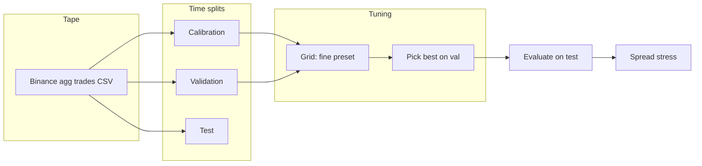
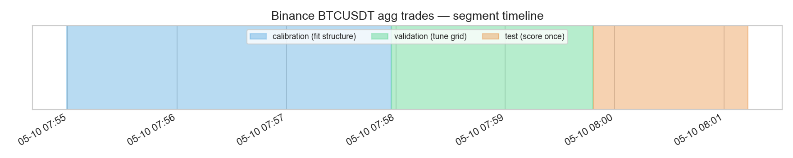
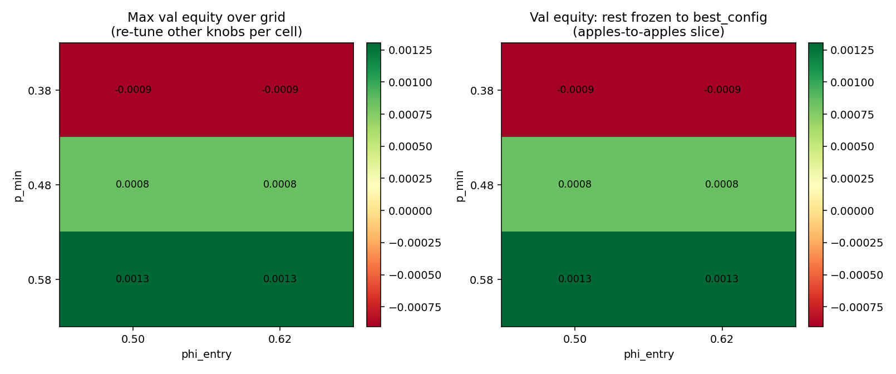
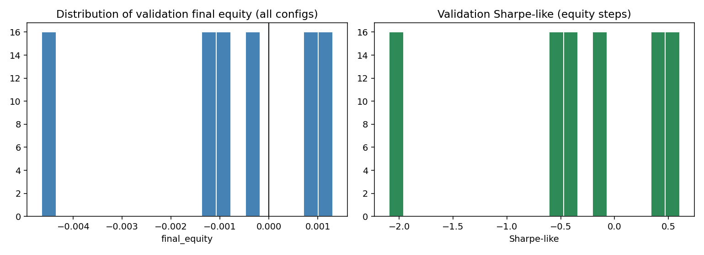
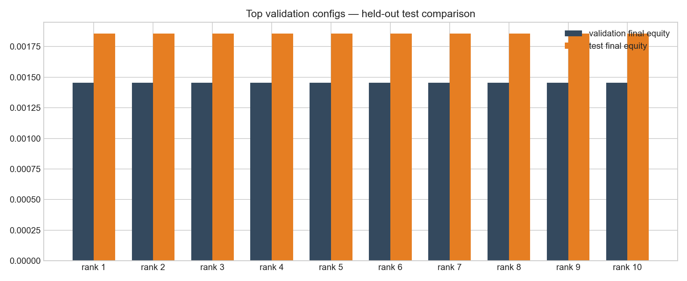
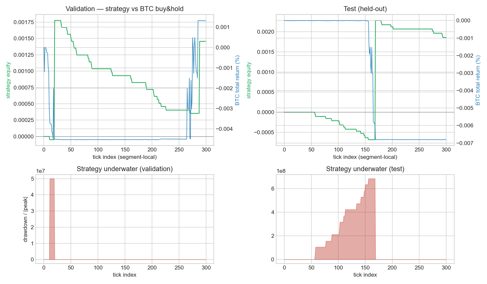
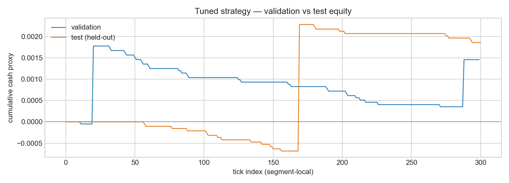
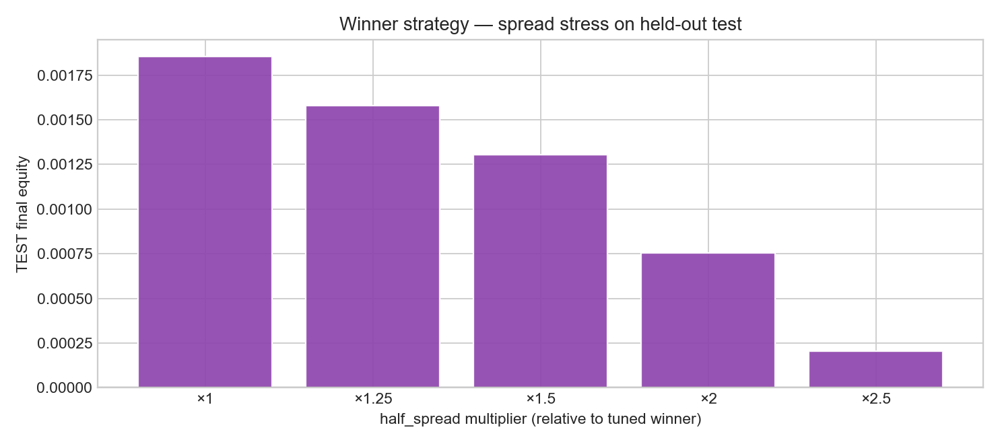

# Metaorder signal (LMF-structured)

Python implementation of the structural metaorder pipeline described in `docs/metaorder_signal.tex`: volatility estimators (range, Parkinson, Yang-Zhang), Clauset-style power-law fitting via `powerlaw`, synthetic-trader sensitivity for \(N\), composite stylised-fact loss, tick-level signal algebra, and an event-driven backtest with square-root impact costs and theory-style capacity \(q < 10^{-4} V_D\).

Notation follows Goliath & Gebbie, *Metaorder modelling and identification from public data* ([arXiv:2602.19590](https://arxiv.org/abs/2602.19590)).

---

## Empirical study at a glance

Public Binance aggregate trades, chronological calibration / validation / test splits, structural fit on calibration only, hyperparameter grid search on validation, single evaluation on test, cost stress on test, figures under `notebooks/` produced by `notebooks/metaorder_tuning_report.ipynb`.

Pipeline: calibration tape, structural parameters, grid search on signal and execution settings using validation only, one scoring pass on test, spread multipliers on the winner for a friction check, JSON summary at `notebooks/tuning_summary.json`.



### 1. Segment timeline

Calibration (structure), validation (search), test (single forward run, no refit).



### 2. Validation hyperparameter surface

Left: maximum validation score over the rest of the grid for each \((p_{\min}, \phi_{\text{entry}})\) pair. Right: same pairs with other parameters fixed to the selected configuration.



### 3. Grid score distribution (validation)

Histogram of validation final equity across all grid points; vertical line at the validation-best setting.



### 4. Leaderboard: validation vs test

Top configurations by validation equity, each replayed on test without further tuning. Bar gaps flag regime shift or selection effects.



### 5. Strategy vs buy-and-hold and drawdown

Upper row: strategy cumulative cash proxy vs BTC buy-and-hold return on the same mid path (twin axes, different units). Lower row: underwater drawdown of the strategy equity path.



### 6. Validation vs test equity (winner)

Same tuned parameters on validation and test segments.



### 7. Spread stress on test

Half-spread multipliers applied on test only to the winning configuration. Stylised friction, not a full execution model.



---

### Snapshot metrics (`notebooks/tuning_summary.json`)

Values update whenever you refetch data or change `MAX_TRADES`. Table below matches the JSON checked into `notebooks/` at this revision.

| Segment | Final equity | Sharpe-like (steps) | Max DD (scale-norm.) |
|---------|--------------|---------------------|------------------------|
| Validation | 0.00146 | 0.68 | 0.80 |
| Test | 0.00186 | 0.62 | 0.30 |

Example winning parameters: `p_min=0.56`, `phi_entry=0.48`, `rho_max=2.2`, `n_min=2`, `half_spread=1e-4`, `kappa=0.006` (full dict in JSON).

Spread stress on test (same snapshot): ×1.0 → 0.00186; ×1.25 → 0.00158; ×1.5 → 0.00131; ×2.0 → 0.00076; ×2.5 → 0.00021.

Spearman IC (survival vs forward log-mid return) was positive on validation and negative on test in this run, so the report spreads metrics across panels instead of a single headline.

### What the run shows

Structural parameters are estimated on calibration only. Hyperparameters are chosen using validation. Test is one forward evaluation. Leaderboard, benchmark, drawdowns, and spread stress are there to surface failure modes rather than a single equity print.

Equity levels are small on the internal cash scale; use them for relative comparison across configurations, not dollar PnL.

### Scope and limits

Data are public crypto aggregate trades, not equity L2. Costs use half-spread and square-root impact as stylised rules; production would add queueing, latency, partial fills, borrow, funding, venue fees.

A finite grid and multiple plots imply selection pressure; a held-out test segment reduces leakage but does not prove tradable edge.

The capacity bound follows the theory-style clip in code; it is not a live capacity estimate.

### Possible extensions

Walk-forward or rolling recalibration with stability tables for \(\hat{\alpha}\), \(V_D\), \(\sigma_D\). Block permutations or shuffles for null distributions of test statistics. Turnover and average spread paid per signal; stress tests in basis points per trade. Always-flat and random-entry baselines under identical cost rules.

---

## Setup

```bash
python3 -m venv .venv
source .venv/bin/activate
pip install -e ".[dev]"
```

## Usage

- End-to-end synthetic demo: `python examples/synthetic_demo.py`
- Large synthetic panel: use `--output-dir` so each symbol is its own file plus `manifest.json`:  
  `python examples/generate_synthetic_market.py --symbols 2000 --metaorders 1500 --sessions 2 --output-dir data/large_panel --format csv --meta-json data/large_meta.json`  
  Defaults are large (500 symbols, 1200 metaorders per symbol per session). Use `--mean-inter-trade 0.12` for denser ticks.
- Plotting scripts live under `visualisation/` (see `visualisation/README.md`):  
  `python visualisation/visualise_run.py --csv data/large_panel/SYM0001.csv --out plots/SYM0001.png`  
  `python visualisation/visualise_panel_overview.py --manifest data/large_panel/manifest.json --out plots/overview.png`  
  (`examples/visualise_run.py` forwards to the same script.)
- Parquet: `pip install -e ".[parquet]"` then `--output-dir … --format parquet`.
- CSV loader: `metaorder_signal.io_taq.load_trades_csv` with columns `timestamp`, `mid`, `quantity`, `sign` (optional `symbol`).
- Core entry points: `process_trade_stream`, `run_event_backtest`, `write_synthetic_dataset`, `generate_panel` on `metaorder_signal`.

## UCT thesis reconstruction (Ezra Goliath)

Inverse-CDF synthetic trader assignment and same-sign metaorder segmentation from the UCT MSc thesis:

- `metaorder_signal.uct_auxiliary`: `trader_participation`, `cumulative_probs`, `orders`, `metaorders_segment_same_sign`
- `metaorder_signal.thesis_reconstruction.reconstruct_metaorders_uct`: adds `synthetic_trader`, `metaorder_id`
- `metaorder_signal.n_selection.evaluate_n_uct` / `grid_search_n_uct`: \(\hat N\) search using thesis routing

Source: [EzraGoliath/Metaorder-modelling-and-identification-Msc-thesis-](https://github.com/EzraGoliath/Metaorder-modelling-and-identification-Msc-thesis-) (`modules/auxiliary_functions.py`). One upstream edge case is patched (single-sign trader streams form one metaorder when length is at least 2). Singleton segments stay excluded from `metaorder_id`, matching thesis tables.

Optional clone (gitignored): `vendor/uct_msc_thesis`.

## Empirical backbone (CLI)

Hold-out evaluation without using the test segment when fitting structure:

1. Time split: earlier trades for calibration, later for evaluation (`experiments/run_empirical_study.py`).
2. Calibration: same-sign run lengths, Clauset `powerlaw` tail \(\hat{\alpha}\); \(V_D\) is total traded quantity in calibration; \(\sigma_D\) is std of consecutive log-mid returns.
3. Hold-out: freeze `MetaorderSignalParams`, run `run_event_backtest`, emit JSON (final equity, Sharpe-like on equity steps, scale-normalised max drawdown, entries, Spearman IC between survival and forward log-mid returns).
4. Data: your CSV or `--fetch-binance BTCUSDT` for public aggregate trades (spot, no API key).

```bash
python experiments/run_empirical_study.py --fetch-binance BTCUSDT --max-trades 50000 --report-dir results/empirical
```

API: `metaorder_signal.empirical` (`calibrate_from_trades`, `compute_metrics`, `extract_run_lengths`). Crypto microstructure differs from listed equities; treat the pipeline as reproducible research code, not evidence of live edge.

## Tuning notebook (regenerate figures and JSON)

```bash
pip install -e ".[notebook]"
jupyter nbconvert --execute notebooks/metaorder_tuning_report.ipynb --to notebook \
  --output metaorder_tuning_report_executed.ipynb
```

Refreshes PNGs under `notebooks/` and writes `notebooks/tuning_summary.json`. First fetch stores Binance trades in `data/binance_BTCUSDT_tuning.csv` (gitignored by default). Set `METAORDER_REFRESH_CACHE=1` to refetch after editing `MAX_TRADES`.

Selection uses validation only; test numbers are out-of-sample relative to that choice but still subject to model risk and simplified costs.

## Tests

```bash
pytest
```
