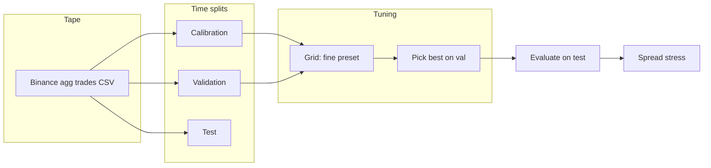

# Metaorder signal (LMF-structured)

Python implementation of the structural metaorder pipeline from `docs/metaorder_signal.tex`: volatility estimators (range, Parkinson, Yang–Zhang), Clauset-style power-law fitting via `powerlaw`, synthetic-trader sensitivity for \(N\), composite stylised-fact loss, tick-level signal algebra, and an event-driven backtest with square-root impact costs and theory-style capacity \(q < 10^{-4} V_D\).

Empirical targets and notation follow Goliath & Gebbie, *Metaorder modelling and identification from public data* ([arXiv:2602.19590](https://arxiv.org/abs/2602.19590)).

---

## Empirical tuning memo (what a quant reviewer sees first)

This section is written like a **short desk note**: what we measure, what the figures show, and what we **do not** claim. All plots below are checked into `notebooks/` and match the pipeline from `notebooks/metaorder_tuning_report.ipynb`.

**Workflow (causal splits):** calibration tape → fit structural parameters → grid-search **signal + execution** hyperparameters on **validation only** → score the winner **once** on **test** → stress execution costs on test → export `notebooks/tuning_summary.json`.



### 1. Chronological coverage

Who sees what time range: calibration (structure), validation (hyperparameter search), test (single forward pass, no refit).


### 2. Hyperparameter surface (validation)

**Left:** best validation score over the rest of the grid for each \((p_{\min}, \phi_{\text{entry}})\) pair — an upper envelope. **Right:** same slice with other knobs frozen to the winning config — marginal sensitivity.


### 3. Distribution of grid scores (validation)

Histogram of all validation final-equity draws in the grid; red line marks the selected best on validation.


### 4. Leaderboard: validation ranking vs held-out test

Top distinct configs by validation equity, replayed on **test** without tuning. Divergence between bars is the usual **overfitting / regime** diagnostic (not a bug in plotting).


### 5. Strategy vs BTC buy-and-hold and underwater drawdown

**Top:** cumulative strategy cash proxy vs simple **buy-and-hold return %** on the same mid path (twin axes — scales differ by construction). **Bottom:** normalised underwater curve for the strategy equity path.


### 6. Validation vs test equity (winner only)

Overlay of the tuned strategy on validation and test segments (different regimes; same parameters).


### 7. Execution stress on test (winner replay)

Half-spread multipliers applied on **test only** — asks whether any validation story survives **wider friction** (still stylised; not a live execution model).


---

### Example metrics (from `notebooks/tuning_summary.json`)

These numbers are **whatever your last notebook run produced**; they change when you refetch tape or change `MAX_TRADES`. Treat them as **illustrative**, not “live performance.”

| Segment | Final equity | Sharpe-like (steps) | Max DD (scale-norm.) |
|---------|--------------|---------------------|------------------------|
| Validation | 0.00146 | 0.68 | 0.80 |
| Test | 0.00186 | 0.62 | 0.30 |

**Winner config (example):** `p_min=0.56`, `phi_entry=0.48`, `rho_max=2.2`, `n_min=2`, `half_spread=1e-4`, `kappa=0.006` (see JSON for full dict).

**Spread stress on test (example):** equity vs baseline multiplier  
×1.0 → 0.00186 · ×1.25 → 0.00158 · ×1.5 → 0.00131 · ×2.0 → 0.00076 · ×2.5 → 0.00021  

**IC note:** validation Spearman IC (survival vs forward log-mid return) was **positive** in this snapshot; test IC was **negative** — that tension is exactly why we show **multiple panels**, not one headline number.

### Findings (honest)

- **Process:** structural parameters are fit only on **calibration**; hyperparameters are selected on **validation**; **test** is a single forward evaluation — the right shape for an exploratory research repo.
- **Robustness hooks:** leaderboard (val→test), buy-and-hold benchmark, drawdowns, and **spread stress** make failure modes visible instead of hiding them behind one equity curve.
- **Scale:** equity numbers are **small** on the toy cash scale used in the backtest; they are useful for **relative** comparison across configs, not dollar PnL.

### Limitations (read before emailing a PM)

- **Data:** public **crypto agg trades**, not equity L2; microstructure and fee models differ from listed equities.
- **Costs:** half-spread + square-root impact are **stylised**; real desks care about queue priority, latency, partial fills, borrow, funding, and coin-specific fees.
- **Statistics:** a **finite grid** plus implicit multiplicity across plots still risks **selection bias**; the held-out segment helps but does not guarantee out-of-sample trading edge.
- **Capacity:** the theory-style capacity clip is a research constraint, not a proved live capacity curve.

### What we would run next (if this were a desk project)

- Walk-forward or rolling **re-calibration** windows; report stability of \(\hat{\alpha}\), \(V_D\), \(\sigma_D\).
- Permutation or **block shuffle** of tape segments for null distributions of test metrics.
- Turnover and **average spread paid** vs signal frequency; tie stress tests to **bps per trade**.
- Side-by-side **always-flat** and **random-entry** baselines with identical cost machinery.

---

## Setup

```bash
python3 -m venv .venv
source .venv/bin/activate
pip install -e ".[dev]"
```

## Usage

- Example end-to-end run on synthetic ticks: `python examples/synthetic_demo.py`
- **Synthetic data (large runs):** use **`--output-dir`** so each symbol is written as its own file plus **`manifest.json`** (avoids one giant CSV in RAM):  
  `python examples/generate_synthetic_market.py --symbols 2000 --metaorders 1500 --sessions 2 --output-dir data/large_panel --format csv --meta-json data/large_meta.json`  
  Defaults are already large (**500 symbols**, **1200 metaorders/symbol/session**, denser inter-trade spacing). Use `--mean-inter-trade 0.12` for even more ticks.
- **Visualisers** are in **`visualisation/`** (not under `examples/`): see **`visualisation/README.md`**. Quick start:  
  `python visualisation/visualise_run.py --csv data/large_panel/SYM0001.csv --out plots/SYM0001.png`  
  `python visualisation/visualise_panel_overview.py --manifest data/large_panel/manifest.json --out plots/overview.png`  
  (`examples/visualise_run.py` still forwards to the canonical script.)
- Optional Parquet shards: `pip install -e ".[parquet]"` then `--output-dir … --format parquet`.
- Load trades with `metaorder_signal.io_taq.load_trades_csv` (expects `timestamp`, `mid`, `quantity`, `sign`; extra columns like `symbol` are allowed).
- Core API: `process_trade_stream`, `run_event_backtest`, `write_synthetic_dataset`, `generate_panel` from `metaorder_signal`.

## UCT thesis reconstruction (Ezra Goliath)

The inverse-CDF synthetic trader assignment + same-sign metaorder segmentation from the UCT MSc thesis are ported as:

- ``metaorder_signal.uct_auxiliary`` — ``trader_participation``, ``cumulative_probs``, ``orders``, ``metaorders_segment_same_sign``
- ``metaorder_signal.thesis_reconstruction.reconstruct_metaorders_uct`` — adds ``synthetic_trader`` and ``metaorder_id`` columns
- ``metaorder_signal.n_selection.evaluate_n_uct`` / ``grid_search_n_uct`` — \( \hat N \) search using thesis routing

Source attribution: [EzraGoliath/Metaorder-modelling-and-identification-Msc-thesis-](https://github.com/EzraGoliath/Metaorder-modelling-and-identification-Msc-thesis-) (`modules/auxiliary_functions.py`). One upstream edge case is patched (when a trader’s stream has a single sign, it now forms one metaorder when length ≥ 2). Singleton segments remain excluded from ``metaorder_id``, matching thesis stylised-fact tables.

Optional reference clone (ignored by git): ``git clone … vendor/uct_msc_thesis``.

## Empirical backbone (CLI)

Hold-out evaluation **without peeking** at the test segment when fitting structure:

1. **Time split** — earlier trades → **calibration**, later trades → **evaluation** (`experiments/run_empirical_study.py`).
2. **Calibration** — same-sign **run lengths** → Clauset-style **`powerlaw`** tail \(\hat{\alpha}\); **\(V_D\)** = total traded qty in the calibration window; **\(\sigma_D\)** = std of consecutive **log-mid** returns.
3. **Hold-out** — freeze **`MetaorderSignalParams`**, run **`run_event_backtest`**, report JSON metrics (final equity, Sharpe-like on equity steps, scale-normalized max drawdown, entry count, Spearman **IC** between survival and forward log-mid returns).
4. **Data** — bring your own CSV, or **`--fetch-binance BTCUSDT`** for **public** aggregate trades (spot, no API key).

```bash
python experiments/run_empirical_study.py --fetch-binance BTCUSDT --max-trades 50000 --report-dir results/empirical
```

Programmatic API: `metaorder_signal.empirical` (`calibrate_from_trades`, `compute_metrics`, `extract_run_lengths`). **Caveat:** live microstructure differs from crypto; use this as a **reproducible pipeline**, not proof of edge.

## Tuning notebook (regenerate all figures + JSON)

```bash
pip install -e ".[notebook]"
jupyter nbconvert --execute notebooks/metaorder_tuning_report.ipynb --to notebook \
  --output metaorder_tuning_report_executed.ipynb
```

This refreshes every PNG under `notebooks/`, including the images embedded above, and writes **`notebooks/tuning_summary.json`**. First run fetches Binance trades into `data/binance_BTCUSDT_tuning.csv` (that path is gitignored by default). Set `METAORDER_REFRESH_CACHE=1` to refetch after changing `MAX_TRADES` in the notebook.

Hyperparameters are tuned on the **validation** segment only; **test** metrics are out-of-sample but still vulnerable to overfitting and stylised costs — **not** a profitability promise.

## Tests

```bash
pytest
```
